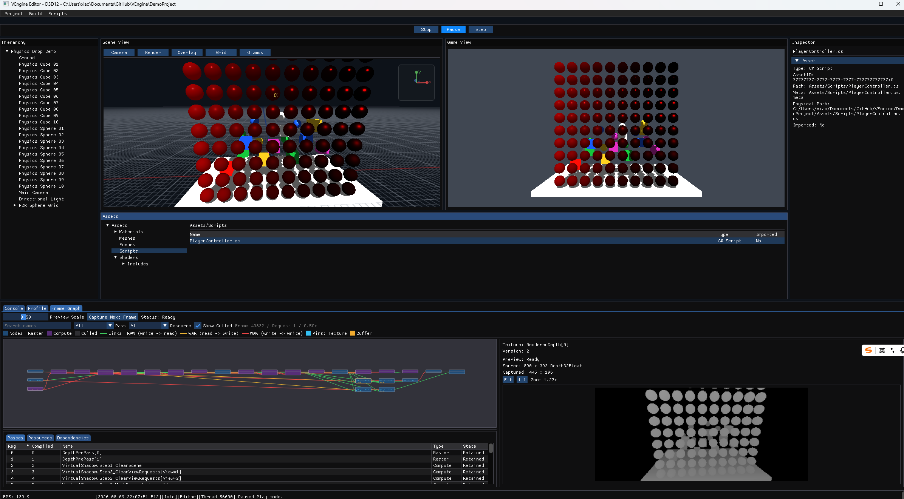

# VEngine

VEngine is a lightweight cross-platform 3D mini game engine built with C++20 and CMake. The runtime is a static library
shared by native Player and Editor applications, with an explicit RHI, a GameObject/Component scene model, an asset
pipeline, C# scripting, and Jolt-based physics.

The project is under active development. Windows with D3D12 is the primary development path; D3D11 is maintained as a
compatibility backend, while macOS/Metal and iOS are earlier platform slices.



The screenshot shows the Windows D3D12 Editor running `DemoProject`: Scene and Game views, a 10 x 10
metallic/smoothness PBR material chart, Hierarchy, Inspector, Assets, Play controls, and the FrameGraph debugger with a
captured depth resource.

## Current Features

### Runtime And Architecture

- C++20 engine runtime built as the `VEngine` static library.
- CMake presets for Windows, macOS, and the initial iOS target.
- Engine-owned Win32, AppKit, and UIKit platform shells; no framework owns the application loop.
- Main/Scene, Render, IO, and Worker thread responsibilities with a render-command boundary between scene and RHI state.
- Job System, IOSystem, InputSystem, TimeSystem, FileSystem, profiling, logging, and assertion infrastructure.
- Boost.Log routed through the VEngine logging facade.

### Rendering

- Explicit common RHI concepts for devices, queues, command lists, fences, swapchains, buffers, textures, samplers, shaders, pipelines, and resource bindings.
- D3D11 and D3D12 backends on Windows, plus the current Metal backend slice on Apple platforms.
- HLSL shader sources compiled to DXBC with FXC, DXIL with DXC, and MSL plus reflection metadata with Slang.
- Forward rendering for static meshes with depth prepass, opaque and transparent passes, cameras, and directional lights.
- FrameGraph scheduling, versioned resources, pass diagnostics, topology visualization, and texture/depth previews in the Editor.
- GPU-driven directional-light Virtual Shadow Maps on D3D11 and D3D12, including clipmaps, persistent physical-page
  caching, request compaction, and bounds-local caster invalidation.
- Metallic-roughness Cook-Torrance PBR using GGX distribution, Smith geometry, and Schlick Fresnel.
- `RGBA16F` Player and Editor Scene/Game scene color, exposure control, ACES/Reinhard tone mapping, and linear-to-sRGB presentation.
- Editor Scene/Game views tone map into dedicated `BGRA8` preview textures before Dear ImGui composition.
- Builtin shader preloading for internal rendering, PBR direct lighting, HDR tone mapping, virtual shadows, and Editor passes.

### Scene, Assets, And Editor

- GameObject/Component scenes with Transform, Camera, MeshRender, Light, Collider, Rigidbody, and C# script components.
- Lightweight reflection used by scene serialization and Editor inspection.
- Text-friendly `.vescene`, `.vematerial`, and `.veshader` assets with GUID metadata.
- OBJ mesh import and runtime-native imported mesh data.
- Project asset database, runtime asset manifest export, and builtin engine assets.
- Dear ImGui Editor with Hierarchy, Inspector, Assets, Scene View, Game View, Console, Profile, and FrameGraph panels.
- Play, Pause, Step, and Stop workflow with editable scene/component state.
- Editor-driven Windows and macOS packaging; an initial macOS-driven iOS packaging path is also present.

### Scripting And Physics

- Desktop C# scripting through .NET native hosting with `nethost`/`hostfxr` and an app-local .NET runtime.
- Script lifecycle support for `OnCreate`, `OnDestroy`, `OnEnable`, `OnDisable`, and `OnUpdate`.
- Project script compilation and reload when returning from Play mode.
- Initial iOS NativeAOT bridge and packaging boundary.
- Jolt-backed box and sphere colliders, rigid bodies, gravity, constraints, and Scene-to-Physics synchronization.

## Current Limitations

- The current PBR shader supports direct Directional Light only. Point Lights, Spot Lights, IBL, PBR texture inputs,
  normal mapping, and BRDF LUT generation are not implemented yet.
- Player and Editor rendering preserve HDR scene color through tone mapping, but their final swapchains remain SDR;
  hardware HDR display output is not implemented.
- GPU-driven Virtual Shadow Maps currently require D3D11 or D3D12. The Metal VSM path is not implemented.
- macOS targets and packaging exist, but the platform path is less mature than Windows.
- The iOS target is an initial UIKit/Metal and NativeAOT packaging slice; touch input, full runtime scene loading, shared
  Player rendering, and device verification remain future work.
- Runtime UI and general-purpose texture asset cooking are not complete.

## Prerequisites

### Windows

- Visual Studio 2022 or Visual Studio 2022 Build Tools with the Desktop development with C++ workload.
- MSVC v143 x64/x86 build tools and a Windows 10/11 SDK.
- CMake 3.25 or newer.
- Python 3, Git, and PowerShell.
- .NET 10 SDK for building the managed script host and project scripts.
- Network access for the first third-party dependency setup.

The Windows presets intentionally use the `Visual Studio 17 2022` generator and the v143 toolset. Installing an older
compiler package only inside a newer Visual Studio release is not sufficient for the documented build path.

### macOS And iOS

- macOS on Apple Silicon with Xcode and the required Apple SDKs.
- CMake 3.25 or newer, Python 3, Git, and the .NET 10 SDK.
- iOS packaging additionally requires valid Xcode signing configuration and the NativeAOT prerequisites described in
  [Docs/IOSPackagingDesign.md](Docs/IOSPackagingDesign.md).

## Clone And Prepare Dependencies

On Windows:

```bat
git clone <repo-url>
cd VEngine
ThirdParty\Build_Windows64.bat
```

The default Windows setup prepares the repository-owned Boost, DirectXShaderCompiler, Slang, Jolt, app-local .NET
runtime, and Windows SDK shader-tool payloads. Dear ImGui and imgui-node-editor sources are vendored in `ThirdParty/`
and validated by CMake.

Generated third-party downloads, build directories, and binaries are not committed. Re-run the setup script when a
dependency payload is missing or after deleting generated third-party directories.

## Configure And Build On Windows

Run CMake through `CMake\Scripts\WithMsvc.bat` so the MSVC x64 developer environment is initialized. From PowerShell, prefix each invocation with `cmd /c`.

Debug:

```bat
cmd /c CMake\Scripts\WithMsvc.bat cmake --preset windows-msvc-debug
cmd /c CMake\Scripts\WithMsvc.bat cmake --build --preset windows-msvc-debug
```

Release:

```bat
cmd /c CMake\Scripts\WithMsvc.bat cmake --preset windows-msvc-release
cmd /c CMake\Scripts\WithMsvc.bat cmake --build --preset windows-msvc-release
```

Tests:

```bat
cmd /c CMake\Scripts\WithMsvc.bat cmake --preset windows-msvc-tests
cmd /c CMake\Scripts\WithMsvc.bat cmake --build --preset windows-msvc-tests
cmd /c CMake\Scripts\WithMsvc.bat ctest --preset windows-msvc-tests
```

The normal Debug and Release presets build applications and tools without unit-test executables. Tests are registered only by the dedicated test preset.

## Run The Demo Project

Launch the Editor with an explicit project path so startup is deterministic:

```powershell
.\Build\windows-msvc-debug\Debug\VEngineWinEditor.exe --project "$PWD\DemoProject"
```

D3D12 is the default Windows backend. Use `--dx11` or `--dx12` to select one explicitly:

```powershell
.\Build\windows-msvc-debug\Debug\VEngineWinEditor.exe --dx12 --project "$PWD\DemoProject"
```

The demo scene contains the physics sample and a red 10 x 10 PBR sphere chart. Metallic increases from left to right; smoothness increases from bottom to top.

## Main Targets

Windows:

- `VEngine` - static engine library.
- `VEngineWinPlayer` - native Windows Player.
- `VEngineWinEditor` - Dear ImGui Windows Editor.
- `VEngineAssetTool` - command-line asset tool.
- `VEngineShaderTool` - HLSL compilation and reflection tool.

Apple platforms:

- `VEngineMacPlayer` - macOS Player executable.
- `VEngineMacEditor` - macOS Editor app bundle.
- `VEngineIOSPlayer` - initial iOS UIKit/Metal app target.
- `VEngineRhiMetalTriangleDemo` - Metal RHI feasibility demo.

Windows build outputs are generated under paths such as:

```text
Build/windows-msvc-debug/Debug
Build/windows-msvc-release/Release
Build/windows-msvc-tests/Debug
```

## macOS And iOS Builds

On macOS:

```sh
cmake --preset mac-debug
cmake --build --preset mac-debug
```

Available iOS presets are:

```text
ios-device-debug
ios-device-release
ios-simulator-debug
```

Prepare iOS third-party inputs with `ThirdParty/Build_IOS.sh` before configuring an iOS preset. See
[Docs/MacPackagingDesign.md](Docs/MacPackagingDesign.md) and
[Docs/IOSPackagingDesign.md](Docs/IOSPackagingDesign.md) for the current packaging scope and limitations.

## Repository Layout

```text
Assets/          Builtin runtime and Editor assets
CMake/           Presets, toolchains, target definitions, and helper scripts
DemoProject/     Example project, scene, scripts, and PBR material chart
Docs/            Architecture, subsystem, packaging, and workflow documentation
Editor/          Shared and platform-specific Editor code
Engine/          Runtime, RHI backends, rendering, and managed script host
Player/          Platform Player entry points
Tests/           Unit, smoke, and RHI demo sources
ThirdParty/      Repository-owned dependency wrappers and vendored sources
Tools/           Asset and shader command-line tools
```

## Documentation

- [Architecture overview](Docs/ArchitectureOverview.md)
- [Development plan](Docs/DevelopmentPlan.md)
- [Coding style](Docs/CodingStyle.md)
- [Render system design](Docs/RenderSystemDesign.md)
- [Shader tool usage](Docs/ShaderToolUsage.md)
- [HLSL to Metal shader flow](Docs/HlslToMetalShaderFlow.md)
- [Editor asset database](Docs/EditorAssetDatabase.md)
- [Windows packaging](Docs/WindowsPackagingDesign.md)
- [macOS packaging](Docs/MacPackagingDesign.md)
- [iOS packaging](Docs/IOSPackagingDesign.md)

## Clean Regeneration

Build outputs live under `Build/`. Delete the relevant preset directory, or delete `Build/`, to force a clean CMake
configure and build. Third-party generated payloads can be recreated with the platform setup scripts under
`ThirdParty/`.
